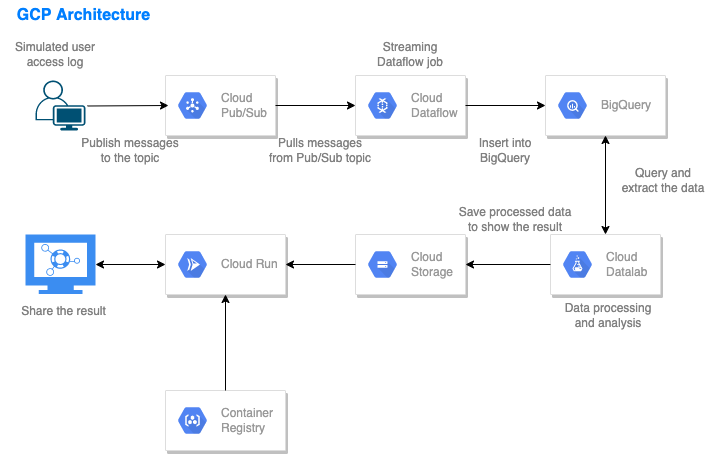
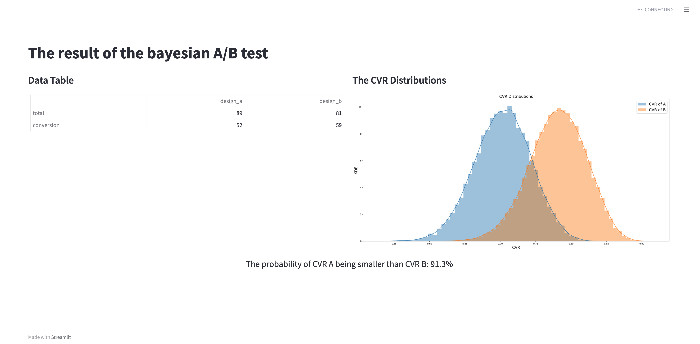

### Intro
This pipeline simulates a streaming data pipeline using cloud Pub/Sub, Dataflow(apache beam), and Bigquery on Google Cloud Platform.
This pipeline, in specific, automates and simplifies the data gathering, data cleaning/santizing, and data processing/analysis from a webserver data source. For example, if stakeholders of a website wanted to measure the conversion rate delta due to a frontend web design change, with this data pipeline, stakeholders will just need to focus on just the interpretation of the final results as everything else is automated.



The stored data in BigQuery is analyzed via Cloud Datalab. 'Design A' was used from '2021-11-11 00:00:01' to '2021-11-30 23:59:59' and 'Design B' was used from '2021-12-01 00:00:01' to '2021-12-21 23:59:59'. The two designs 2 are compared using Bayesian statistics.

GCP services used in this project:
  - Cloud Pub/Sub (Streaming data is published to a Pub/Sub topic)
  - Cloud Dataflow (Pulls data from the Pub/Sub topic, cleans the data, and inserts into BigQuery)
  - BigQuery (Stores the streaming data)
  - Cloud Datalab (Processes and analyzes data)
  - Cloud Storage (Stores processed data)
  - Cloud Run (Deploys the containerized streamlit application)
  - Container Registry (Manages Docker images)

---

### Result Display


---

### Pipeline Create Command (on Cloud Shell)

- Create virtual environment for generating data

`virtualenv VIRTUAL_ENV_NAME`

- Activate it

`source bin/activate`

- Install libraries

`pip install -r requirements.txt`

- Run a python file

`python generate_data.py`


- Create Dataflow jobs (while the generate_data.py is running)
```
python pipeline.py \
    --streaming \
    --runner DataflowRunner \
    --project YOUR_PROJECT_ID \
    --temp_location gs://YOUR_BUCKET/temp \
    --staging_location gs://YOUR_BUCKET/staging \
    --job_name YOUR_JOB_NAME \
    --region REGION
```
